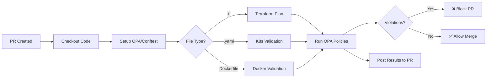

# OPA Security Gate - GitHub Actions CI/CD Integration

**Purpose:** Validate Infrastructure as Code (IaC) and Kubernetes manifests against OPA security policies during CI/CD

**Compliance:** CIS Benchmarks, PCI-DSS 6.5, NIST SP 800-53

---

## 🎯 Overview

This GitHub Actions workflow integrates **OPA (Open Policy Agent)** into your CI/CD pipeline to enforce security policies BEFORE infrastructure is deployed. It acts as a **security gate** that prevents insecure configurations from reaching production.

### What Gets Validated

| Asset Type | Tool | Policies | Blocking |
|------------|------|----------|----------|
| **Terraform** | Conftest | `terraform-security.rego` | ✅ Yes |
| **Kubernetes** | Conftest | `kubernetes.rego`, `rbac.rego`, `network.rego` | ✅ Yes |
| **Dockerfiles** | Conftest | `image-security.rego` | ✅ Yes |
| **CI/CD Configs** | OPA | `cicd-security.rego` | ⚠️ Warning only |

---

## 📁 File Structure

```
3-Hardening/
├── ci-cd-pipelines/
│   └── github-actions/
│       ├── opa-security-gate.yml          # Main GHA workflow
│       ├── README.md                       # This file
│       └── examples/
│           ├── terraform-example.tf
│           ├── kubernetes-example.yaml
│           └── Dockerfile-example
│
└── policies/
    └── opa/
        ├── terraform-security.rego         # Terraform policies
        ├── terraform-security_test.rego    # OPA tests
        ├── kubernetes.rego                 # K8s policies
        ├── rbac.rego                       # RBAC policies
        ├── network.rego                    # Network policies
        ├── image-security.rego             # Container policies
        └── cicd-security.rego              # CI/CD policies
```

---

## 🚀 Quick Start

### 1. Add Workflow to Your Repository

Copy the workflow file to your project:

```bash
# In your project repository
mkdir -p .github/workflows
cp GP-CONSULTING/3-Hardening/ci-cd-pipelines/github-actions/opa-security-gate.yml \
   .github/workflows/
```

### 2. Copy OPA Policies

```bash
# Copy OPA policies to your project
mkdir -p .conftest
cp -r GP-CONSULTING/3-Hardening/policies/opa/* .conftest/
```

**Alternative:** Reference policies from GP-CONSULTING (recommended for shared policies):

```yaml
# In your workflow
- name: Validate with OPA
  run: |
    conftest test terraform/ \
      --policy ../GP-CONSULTING/3-Hardening/policies/opa \
      --namespace terraform.security
```

### 3. Commit and Push

```bash
git add .github/workflows/opa-security-gate.yml
git commit -m "ci: Add OPA security gate"
git push
```

The workflow will automatically run on:
- Pull requests to `main`, `master`, or `develop`
- Pushes to those branches
- Changes to `.tf`, `.yaml`, `.yml`, or `Dockerfile*` files

---

## 🔧 How It Works

### Workflow Steps



### Job Breakdown

#### Job 1: OPA Policy Tests
- **Purpose:** Test OPA policies themselves (unit tests)
- **Command:** `opa test . --verbose`
- **Runs:** Always (validates policy logic)

#### Job 2: Terraform Validation
- **Purpose:** Validate Terraform configurations against security policies
- **Steps:**
  1. `terraform init -backend=false`
  2. `terraform plan -out=tfplan.binary`
  3. `terraform show -json tfplan.binary > tfplan.json`
  4. `conftest test tfplan.json --policy ... --namespace terraform.security`
- **Triggers:** When `.tf` files change

#### Job 3: Kubernetes Validation
- **Purpose:** Validate Kubernetes manifests
- **Steps:**
  1. Find files with `apiVersion:` (K8s manifests)
  2. `conftest test manifest.yaml --policy ... --namespace kubernetes.security`
- **Triggers:** When `.yaml` or `.yml` files change

#### Job 4: Docker Validation
- **Purpose:** Validate Dockerfiles for security best practices
- **Steps:**
  1. Find all `Dockerfile*` files
  2. `conftest test Dockerfile --policy ... --namespace docker.security`
- **Triggers:** When `Dockerfile*` files change

#### Job 5: Security Gate Summary
- **Purpose:** Aggregate results and post summary to PR
- **Blocks merge if:** Any critical validation fails

---

## 📋 Example: Terraform Validation

### Bad Terraform (Will FAIL OPA Gate)

```hcl
# terraform/s3.tf
resource "aws_s3_bucket" "data" {
  bucket = "my-data-bucket"
  # ❌ No encryption
  # ❌ No public access block
}
```

**OPA Results:**
```
❌ S3 bucket 'aws_s3_bucket.data' must have server-side encryption enabled
❌ S3 bucket 'aws_s3_bucket.data' must have public access block enabled
```

**PR Status:** ❌ Blocked

---

### Good Terraform (Will PASS OPA Gate)

```hcl
# terraform/s3.tf
resource "aws_s3_bucket" "data" {
  bucket = "my-data-bucket"
}

resource "aws_s3_bucket_server_side_encryption_configuration" "data" {
  bucket = aws_s3_bucket.data.id

  rule {
    apply_server_side_encryption_by_default {
      sse_algorithm = "AES256"
    }
  }
}

resource "aws_s3_bucket_public_access_block" "data" {
  bucket = aws_s3_bucket.data.id

  block_public_acls       = true
  block_public_policy     = true
  ignore_public_acls      = true
  restrict_public_buckets = true
}
```

**OPA Results:**
```
✅ S3 bucket encryption: PASS
✅ S3 public access block: PASS
```

**PR Status:** ✅ Allowed

---

## 📋 Example: Kubernetes Validation

### Bad Kubernetes Manifest (Will FAIL OPA Gate)

```yaml
# k8s/deployment.yaml
apiVersion: apps/v1
kind: Deployment
metadata:
  name: myapp
spec:
  replicas: 3
  selector:
    matchLabels:
      app: myapp
  template:
    metadata:
      labels:
        app: myapp
    spec:
      containers:
      - name: app
        image: myapp:latest  # ❌ No specific version
        # ❌ No resource limits
        # ❌ No security context
```

**OPA Results:**
```
❌ Container 'app' must specify resource limits
❌ Container 'app' must have security context (runAsNonRoot)
❌ Image must use specific version tag, not 'latest'
```

**PR Status:** ❌ Blocked

---

### Good Kubernetes Manifest (Will PASS OPA Gate)

```yaml
# k8s/deployment.yaml
apiVersion: apps/v1
kind: Deployment
metadata:
  name: myapp
spec:
  replicas: 3
  selector:
    matchLabels:
      app: myapp
  template:
    metadata:
      labels:
        app: myapp
    spec:
      securityContext:
        runAsNonRoot: true
        runAsUser: 1000
      containers:
      - name: app
        image: myapp:v1.2.3  # ✅ Specific version
        resources:           # ✅ Resource limits
          requests:
            memory: "128Mi"
            cpu: "100m"
          limits:
            memory: "256Mi"
            cpu: "200m"
        securityContext:     # ✅ Security context
          allowPrivilegeEscalation: false
          readOnlyRootFilesystem: true
```

**OPA Results:**
```
✅ Resource limits: PASS
✅ Security context: PASS
✅ Image tag version: PASS
```

**PR Status:** ✅ Allowed

---

## 🔍 Viewing Results

### In GitHub Actions UI

1. Go to **Actions** tab in your repository
2. Click on the workflow run
3. View individual job results:
   - `OPA Policy Tests` - Policy unit tests
   - `Terraform + OPA Validation` - Terraform results
   - `Kubernetes + OPA Validation` - K8s results
   - `Dockerfile + OPA Validation` - Docker results

### In Pull Request Comments

The workflow automatically posts a comment to your PR with results:

```markdown
## OPA Security Gate Results

### terraform/main.tf

❌ **Failures (2):**
- S3 bucket 'aws_s3_bucket.data' must have server-side encryption enabled
- S3 bucket 'aws_s3_bucket.data' must have public access block enabled

⚠️ **Warnings (1):**
- Consider enabling versioning for S3 bucket

✅ **Passed (15 checks)**
```

---

## ⚙️ Configuration

### Customize Policy Namespaces

Edit `.github/workflows/opa-security-gate.yml`:

```yaml
# For Terraform
conftest test tfplan.json \
  --policy policies/opa \
  --namespace terraform.security  # Change this

# For Kubernetes
conftest test manifest.yaml \
  --policy policies/opa \
  --namespace kubernetes.security  # Change this
```

### Skip Validation for Specific Files

Add to your workflow:

```yaml
- name: Validate Terraform
  run: |
    # Exclude specific directories
    conftest test terraform/ \
      --policy policies/opa \
      --ignore "terraform/legacy/*" \
      --namespace terraform.security
```

### Run as Warning-Only (Non-blocking)

```yaml
- name: Validate Terraform (non-blocking)
  run: |
    conftest test terraform/ \
      --policy policies/opa \
      --namespace terraform.security || true  # Don't fail workflow
```

---

## 🧪 Testing OPA Policies Locally

### Test Policies

```bash
cd GP-CONSULTING/3-Hardening/policies/opa

# Run OPA policy unit tests
opa test . --verbose

# Run tests with coverage
opa test . --coverage --format=json
```

### Test Against Real Terraform

```bash
cd /path/to/terraform

# Generate plan
terraform init
terraform plan -out=tfplan.binary
terraform show -json tfplan.binary > tfplan.json

# Test with Conftest
conftest test tfplan.json \
  --policy ~/GP-CONSULTING/3-Hardening/policies/opa \
  --namespace terraform.security
```

### Test Against Kubernetes Manifests

```bash
conftest test k8s/deployment.yaml \
  --policy ~/GP-CONSULTING/3-Hardening/policies/opa \
  --namespace kubernetes.security
```

---

## 🔗 Integration with Other Phases

### ← Phase 1: Security Assessment
- Phase 1 scanners detect vulnerabilities in **existing** infrastructure
- Phase 3 OPA gate **prevents** new vulnerabilities from being deployed

### → Phase 4: Cloud Migration
- OPA validates Terraform modules before AWS deployment
- Ensures migrated infrastructure meets security standards

### → Phase 5: Compliance Audit
- OPA results serve as evidence for compliance audits
- Demonstrates **shift-left security** (catch issues before deployment)

---

## 📊 Metrics & Reporting

### Track OPA Gate Effectiveness

```bash
# Count violations prevented
cat .github/workflows/opa-security-gate.yml | \
  grep -A 50 "Terraform Validation" | \
  grep "❌" | wc -l

# Generate compliance report
conftest test terraform/ \
  --policy policies/opa \
  --namespace terraform.security \
  --output json > opa-compliance-report.json
```

---

## 🛠️ Troubleshooting

### OPA Policy Test Failures

**Problem:** `opa test` fails with "undefined reference"

**Solution:**
```bash
# Check policy syntax
opa check policies/opa/terraform-security.rego

# Run with verbose output
opa test . --verbose --explain=full
```

---

### Conftest Not Finding Policies

**Problem:** `conftest test` says "no policies found"

**Solution:**
```bash
# Ensure policies are in correct directory structure
.conftest/
└── policy/
    └── terraform-security.rego  # Must be in 'policy/' subdirectory

# Or specify policy path explicitly
conftest test tfplan.json --policy ./policies/opa
```

---

### GitHub Actions Workflow Not Triggering

**Problem:** Workflow doesn't run on PR

**Solution:**
```yaml
# Check workflow triggers
on:
  pull_request:
    branches: [main, master, develop]
    paths:
      - '**.tf'  # Ensure this matches your file structure
```

---

## 📖 Additional Resources

- **OPA Documentation:** https://www.openpolicyagent.org/docs/
- **Conftest Documentation:** https://www.conftest.dev/
- **OPA Playground:** https://play.openpolicyagent.org/
- **Phase 3 Policies:** [../../policies/opa/](../../policies/opa/)

---

## 🔄 Next Steps

1. ✅ Copy workflow to `.github/workflows/`
2. ✅ Copy OPA policies to `.conftest/policy/`
3. ✅ Create a test PR with Terraform changes
4. ✅ Verify OPA gate runs and validates
5. ⚠️ Fix any policy violations
6. ✅ Merge PR once gate passes

---

**Version:** 1.0
**Last Updated:** 2025-10-15
**Status:** ✅ Production-Ready
