# 🔄 GP-Copilot: Complete API & Workflow Diagram

## 🎯 Executive Summary

**GP-Copilot = AI-Powered Security Consulting Platform**
- **Input**: Client projects + security questions
- **Process**: Automated scanning + AI analysis + Human-like consultation
- **Output**: Professional security assessments + actionable remediation plans

---

## 🏗️ System Component Map

```
GP-COPILOT PLATFORM ARCHITECTURE
═════════════════════════════════

┌─────────────────────────────────────────────────────────────────┐
│                     🎛️ GP-CONFIG-OPS                            │
│                   "Mission Control Center"                      │
│  ┌─────────────────┬──────────────────┬─────────────────────┐  │
│  │ platform-       │ scanners.json    │ gp_status.py        │  │
│  │ config.yaml     │ (tool configs)   │ (health monitor)    │  │
│  │ (master config) │                  │                     │  │
│  └─────────────────┴──────────────────┴─────────────────────┘  │
└─────────────────────────────────────────────────────────────────┘
                                │
                    ┌───────────┼───────────┐
                    ▼           ▼           ▼

┌─────────────┐  ┌─────────────┐  ┌─────────────┐  ┌─────────────┐
│ 🔧 GP-TOOLS │  │ 🤖 GP-AI    │  │ 👥 GP-AGENTS│  │ 💾 GP-DATA  │
│             │  │             │  │             │  │             │
│ • gitleaks  │  │ • Jade AI   │  │ • bandit    │  │ • Scans     │
│ • kubescape │  │ • RAG DB    │  │ • trivy     │  │ • Fixes     │
│ • tfsec     │  │ • Qwen2.5   │  │ • checkov   │  │ • Archive   │
│             │  │ • Engines   │  │ • opa       │  │ • Models    │
└─────────────┘  └─────────────┘  └─────────────┘  └─────────────┘
       │                │                │                │
       └────────────────┼────────────────┼────────────────┘
                        │                │
                        ▼                ▼
┌─────────────────────────────────────────────────────────────────┐
│                    📁 GP-PROJECTS                                │
│              "Client Engagements"                               │
│  Portfolio  │  INTERVIEW-DEMO  │  LinkOps-MLOps  │  Terraform   │
│  (HIPAA)    │  (Demo)          │  (MLOps)        │  (IaC)       │
└─────────────────────────────────────────────────────────────────┘
```

---

## 🔄 Complete Workflow: Step-by-Step API Calls

### **Phase 1: System Initialization**
```python
# 1. Load Master Configuration
config_path = "GP-CONFIG-OPS/platform-config.yaml"
config = yaml.load(config_path)

# 2. Initialize Data Paths
from james_config.gp_data_config import GPDataConfig
data_config = GPDataConfig()
scan_dir = data_config.get_scan_directory()  # GP-DATA/active/scans/

# 3. Initialize AI System
from GP_AI import ai_security_engine, rag_engine, scan_integrator
jade = JadeEnhanced()
```

### **Phase 2: Security Scanning Pipeline**
```bash
# CLI Command
./gp-security scan Portfolio --compliance=HIPAA
```

```python
# Internal API Flow
def execute_security_scan(project_path: str, compliance: str):

    # 1. Load scanner configuration
    scanner_config = load_json("GP-CONFIG-OPS/GP-config/scanners.json")

    # 2. Initialize scanners based on config
    scanners = []
    for tool in scanner_config["enabled_tools"]:
        scanner_class = get_scanner_class(tool)  # bandit, trivy, etc.
        scanner = scanner_class(
            output_dir=scan_dir,
            tool_path=f"bin/{tool}",  # symlinks to GP-TOOLS/
            timeout=scanner_config["timeout"]
        )
        scanners.append(scanner)

    # 3. Execute scans in parallel
    scan_results = []
    with ThreadPoolExecutor(max_workers=4) as executor:
        futures = [
            executor.submit(scanner.scan, project_path)
            for scanner in scanners
        ]

        for future in as_completed(futures):
            result = future.result()
            scan_results.append(result)

            # Save result immediately
            save_path = scan_dir / f"{result['tool']}_latest.json"
            save_json(result, save_path)

    return scan_results
```

### **Phase 3: AI Analysis & Intelligence**
```python
# User Query API
def query_jade(question: str, project: str = None):

    # 1. Initialize Jade with full context
    jade = JadeEnhanced()

    # 2. Parallel data gathering
    async def gather_context():
        # Get real-time scan results
        scan_insights = scan_integrator.generate_insights(project)

        # Query knowledge base
        rag_context = rag_engine.query_knowledge(question, n_results=5)

        # Analyze compliance gaps
        compliance_gaps = {
            framework: scan_integrator.get_compliance_gaps(framework)
            for framework in ["CIS", "SOC2", "HIPAA", "PCI-DSS"]
        }

        # Aggregate all findings
        aggregated = scan_integrator.aggregate_findings(project)

        return {
            "scan_insights": scan_insights,
            "rag_context": rag_context,
            "compliance_gaps": compliance_gaps,
            "aggregated_findings": aggregated
        }

    # 3. Generate intelligent response
    context = asyncio.run(gather_context())
    response = jade.analyze_with_context(question, context)

    return response
```

### **Phase 4: Data Integration Layer**
```python
# Scan Results Integration API
class ScanResultsIntegrator:

    def generate_insights(self, project: str = None):
        """Real-time analysis of scan results"""

        # 1. Load recent scan files
        scan_files = list(self.scan_dir.glob("*_latest.json"))

        # 2. Aggregate findings across tools
        aggregated = {
            "total_findings": 0,
            "by_severity": {"critical": 0, "high": 0, "medium": 0, "low": 0},
            "by_tool": {},
            "risk_score": 0.0,
            "business_impact": 0
        }

        for scan_file in scan_files:
            with open(scan_file) as f:
                scan_data = json.load(f)

            # Filter by project if specified
            if project and project not in scan_data.get("target", ""):
                continue

            # Aggregate findings
            findings = scan_data.get("findings", [])
            tool = scan_data.get("tool", "unknown")

            for finding in findings:
                severity = finding.get("severity", "low").lower()
                aggregated["by_severity"][severity] += 1
                aggregated["total_findings"] += 1

                # Calculate risk contribution
                risk_weight = {"critical": 10, "high": 7.5, "medium": 5, "low": 2.5}
                aggregated["risk_score"] += risk_weight.get(severity, 1)

                # Business impact calculation
                impact_cost = {"critical": 50000, "high": 10000, "medium": 2000, "low": 500}
                aggregated["business_impact"] += impact_cost.get(severity, 0)

        # 3. Generate insights
        insights = []
        if aggregated["by_severity"]["critical"] > 0:
            insights.append({
                "type": "IMMEDIATE_ACTION",
                "message": f"{aggregated['by_severity']['critical']} critical findings require immediate attention",
                "business_impact": f"${aggregated['business_impact']:,} potential risk exposure"
            })

        return insights
```

---

## 📊 Data Flow Architecture

```mermaid
graph TB
    A[👤 User Query] --> B[🎛️ GP-CONFIG-OPS]
    B --> C[⚙️ Load Configuration]
    C --> D[🔧 Initialize Tools]

    D --> E[📁 Scan GP-PROJECTS]
    E --> F[🤖 GP-CONSULTING-AGENTS]

    F --> G[🔧 Execute Tools]
    G --> H[💾 Save to GP-DATA]

    H --> I[🤖 GP-AI Integration]
    I --> J[📊 Aggregate Results]
    J --> K[🧠 RAG Knowledge Query]

    K --> L[🎯 AI Analysis]
    L --> M[💡 Generate Response]
    M --> N[📋 Recommendations]

    N --> O[👤 Human-Like Consultation]

    subgraph "Data Storage"
        H --> P[GP-DATA/active/scans/]
        P --> Q[GP-DATA/active/fixes/]
        Q --> R[GP-DATA/vector-db/]
    end

    subgraph "AI Processing"
        I --> S[ScanResultsIntegrator]
        S --> T[RAG Engine]
        T --> U[Security Reasoning]
        U --> V[Jade Enhanced]
    end
```



---

## 🔗 API Integration Points

### **Configuration API**
```python
# GP-CONFIG-OPS Integration
from GP_CONFIG_OPS.gp_config import PlatformConfig

config = PlatformConfig("platform-config.yaml")
enabled_scanners = config.get_enabled_scanners()  # ['bandit', 'trivy', ...]
data_paths = config.get_data_paths()              # {scans: "GP-DATA/active/scans/"}
```

### **Scanning API**
```python
# GP-CONSULTING-AGENTS Integration
from GP_CONSULTING_AGENTS.scanners import get_scanner

scanner = get_scanner("bandit")
results = scanner.scan(
    target="GP-PROJECTS/Portfolio/",
    output=data_paths["scans"],
    config=config.get_scanner_config("bandit")
)
```

### **AI Intelligence API**
```python
# GP-AI Integration
from GP_AI.jade_enhanced import JadeEnhanced

jade = JadeEnhanced()
analysis = jade.analyze_with_context(
    query="What is our HIPAA compliance status?",
    project="Portfolio"
)

# Returns: {response, context, confidence, recommendations, next_steps}
```

### **Data Access API**
```python
# GP-DATA Integration
from GP_AI.integrations.scan_results_integrator import scan_integrator

# Get recent findings
recent_scans = scan_integrator.get_recent_scans(hours=24)

# Generate business insights
insights = scan_integrator.generate_insights(project="Portfolio")

# Compliance analysis
hipaa_gaps = scan_integrator.get_compliance_gaps("HIPAA")
```

---

## 🎯 Complete Example: End-to-End Flow

```python
#!/usr/bin/env python3
"""
Complete GP-Copilot Workflow Example
Shows how all components connect
"""

async def complete_security_consultation(project_name: str, question: str):
    """End-to-end security consultation workflow"""

    print(f"🚀 Starting security consultation for {project_name}")

    # PHASE 1: Configuration & Setup
    config = PlatformConfig("GP-CONFIG-OPS/platform-config.yaml")
    data_config = GPDataConfig()

    # PHASE 2: Execute Security Scans
    project_path = f"GP-PROJECTS/{project_name}/"

    # Initialize scanners based on config
    scanner_manager = ScannerManager(config)
    scan_results = await scanner_manager.scan_project(project_path)

    print(f"✅ Completed {len(scan_results)} security scans")

    # PHASE 3: AI Analysis
    jade = JadeEnhanced()

    # Get full context analysis
    analysis = jade.analyze_with_context(
        query=question,
        project=project_name
    )

    print(f"🤖 Jade Analysis Complete:")
    print(f"   Confidence: {analysis['confidence']:.1%}")
    print(f"   Risk Score: {analysis['context']['risk_metrics']['risk_score']:.1f}")
    print(f"   Critical Issues: {analysis['context']['risk_metrics']['critical_count']}")

    # PHASE 4: Generate Response
    print(f"\n💬 Jade's Response:")
    print(analysis['response'])

    print(f"\n📋 Recommendations:")
    for rec in analysis['recommendations']:
        print(f"   • {rec}")

    print(f"\n🎯 Next Steps:")
    for step in analysis['next_steps']:
        print(f"   • {step}")

    return analysis

# Example Usage
if __name__ == "__main__":
    result = asyncio.run(
        complete_security_consultation(
            project_name="Portfolio",
            question="What is our HIPAA compliance risk?"
        )
    )
```

---

## 🎯 Summary: The Complete Picture

**GP-Copilot is a unified AI security consulting platform where:**

1. **GP-CONFIG-OPS** = Mission control (configures everything)
2. **GP-TOOLS** = Security tool arsenal (centralized binaries)
3. **GP-CONSULTING-AGENTS** = Automated security teams (scanners + policies)
4. **GP-AI** = Jade intelligence layer (human-like AI consultant)
5. **GP-DATA** = Central memory (results, knowledge, models)
6. **GP-PROJECTS** = Client engagements (targets for analysis)

**The API connections flow like this:**
```
Configuration → Tool Execution → Data Storage → AI Analysis → Human-Like Consultation
```

**Every component knows about the others through:**
- Shared configuration (GP-CONFIG-OPS)
- Common data paths (GP-DATA)
- Python imports and APIs
- File system conventions

It's essentially **"Jarvis for Cybersecurity"** - an intelligent platform that can scan, analyze, and consult on security matters with human-like expertise.

---
*Complete API & Workflow Documentation*
*GP-Copilot Platform v2.0.0*
*Date: 2025-09-29*